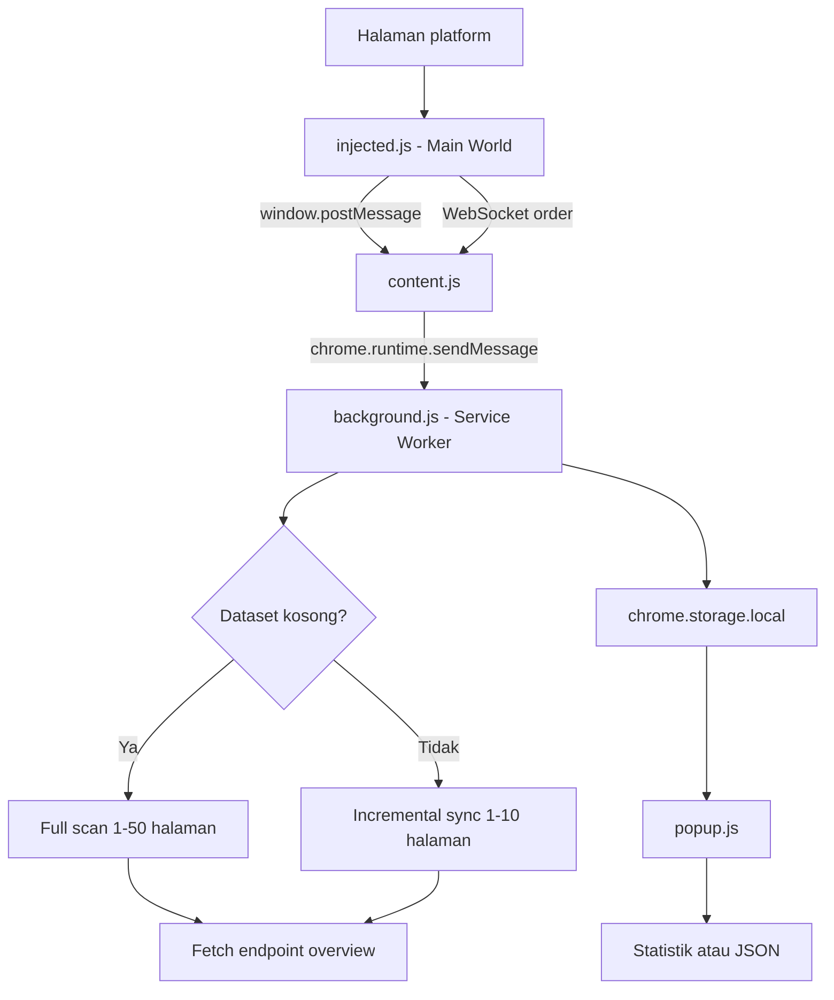

# Booking Scraper Extension

Ekstensi browser Manifest V3 untuk menangkap konfigurasi request daftar booking/order dari aplikasi web yang sedang dibuka, mengambil data secara bertahap, menambahkan detail per item, dan mengekspor dataset sebagai JSON.

Repository ini adalah template yang perlu disesuaikan dengan API platform target. Nilai endpoint di source code masih berupa placeholder, sehingga ekstensi belum dapat digunakan sebelum konfigurasi endpoint diisi.

**Versi manifest:** `1.4.0`

**Build:** tidak diperlukan; tidak ada dependency eksternal atau bundler.

## Status Konfigurasi

Sebelum memuat ekstensi, isi dua placeholder berikut:

1. `TARGET_ENDPOINT` di `injected.js`: bagian URL endpoint daftar yang harus diintersep.
2. `[Endpoint for Overview]` di `background.js`: path endpoint untuk mengambil detail satu item.

Keduanya bergantung pada kontrak API platform target. Jangan menghapus autentikasi dari browser; ekstensi memanfaatkan sesi login yang sedang aktif.

## Cara Memasang

### Untuk penggunaan tanpa Developer mode

Chrome tidak mengizinkan ekstensi lokal dari folder atau file ZIP dipasang sebagai ekstensi biasa tanpa Developer mode. Ini adalah aturan keamanan browser dan tidak dapat diubah oleh kode ekstensi.

Untuk instalasi tanpa Developer mode:

1. Isi semua placeholder endpoint dan uji ekstensi menggunakan **Load unpacked**.
2. Jalankan `./build-release.sh` untuk membuat `dist/booking-scraper-extension.zip`.
3. Daftarkan akun developer di [Chrome Web Store Developer Dashboard](https://chrome.google.com/webstore/devconsole).
4. Pilih **New item**, unggah file ZIP tersebut, lengkapi listing, privacy policy, dan deklarasi permission, lalu kirim untuk review.
5. Setelah disetujui, pengguna memasang ekstensi dari halaman Chrome Web Store tanpa mengaktifkan Developer mode.

Setiap pembaruan harus dibuat sebagai ZIP baru, nomor `version` di `manifest.json` harus dinaikkan, lalu paket diunggah sebagai versi baru. Untuk organisasi internal, alternatifnya adalah distribusi melalui kebijakan enterprise Chrome; itu memerlukan administrasi perangkat dan bukan perubahan pada source code.

### Untuk pengujian lokal

1. Gunakan Chrome, Edge, atau browser Chromium lain yang mendukung Manifest V3.
2. Buka `chrome://extensions` atau `edge://extensions`.
3. Aktifkan **Developer mode**.
4. Pilih **Load unpacked** atau **Muat tanpa kemasan**.
5. Pilih folder repository yang berisi `manifest.json`.
6. Setelah mengubah source code, tekan **Reload** pada kartu ekstensi.

Tidak ada dependency eksternal. Skrip `build-release.sh` hanya membuat paket ZIP untuk diunggah ke Chrome Web Store; skrip tersebut tidak menghilangkan kebutuhan Developer mode untuk pengujian lokal. Perubahan pada `injected.js` dan `background.js` baru berlaku setelah ekstensi di-reload, lalu halaman target di-reload agar content script dipasang ulang.

## Cara Menggunakan

1. Login ke platform target dan buka halaman yang memuat daftar booking/order.
2. Pastikan endpoint daftar sudah diisi di `injected.js`.
3. Reload halaman target dan tunggu request daftar selesai agar konfigurasi API tersimpan.
4. Buka popup ekstensi:
   - **Reset & Full Scan** menghapus dataset lalu memindai maksimal 50 halaman.
   - **Cek Order Baru** menjalankan incremental sync secara manual.
   - **Unduh Hasil JSON** mengunduh seluruh dataset lokal.
5. Biarkan halaman target tetap terbuka bila ingin menerima event order dari WebSocket.

Saat konfigurasi API baru tertangkap, ekstensi otomatis menjalankan full scan bila dataset kosong. Jika dataset sudah berisi data, ekstensi menjalankan incremental sync.

## Fitur dan Batas Operasi

- Mengintersep `fetch` dan `XMLHttpRequest` yang URL-nya memuat `TARGET_ENDPOINT`.
- Menerima event WebSocket jika payload memiliki `id`, `booking_id`, atau `order_id`.
- Menyimpan konfigurasi request, dataset, dan status sinkronisasi di `chrome.storage.local`.
- Menjalankan alarm incremental sync setiap 1 menit setelah ekstensi dipasang.
- Menggunakan lock agar full scan dan incremental sync tidak berjalan bersamaan.
- Menampilkan jumlah dataset dan order baru pada popup serta badge ekstensi.
- Mengirim notifikasi desktop ketika incremental sync menemukan order baru.
- Full scan dibatasi 50 halaman, sedangkan incremental sync dibatasi 10 halaman.
- Ukuran halaman yang digunakan adalah 20 item.
- Enrichment berjalan dalam batch maksimal 5 item dengan jeda 150 ms.

## Alur Data



### Full scan

Scan dimulai dari halaman 1 dan berhenti ketika response gagal, response kosong, tidak ada item baru, atau batas 50 halaman tercapai. Untuk request `POST`, parameter pagination ditambahkan ke body. Untuk method lain, parameter tersebut ditambahkan ke query string.

Parameter yang dikirim untuk kompatibilitas backend adalah `page`, `page_no`, `pageNo`, `page_number`, `current`, `pageSize`, `page_size`, `size`, dan `offset`.

Item dideduplikasi menggunakan field pertama yang tersedia dari `id`, `booking_id`, `id_booking`, `booking_no`, atau `code`. Item yang berhasil dikumpulkan kemudian diperkaya melalui endpoint overview.

### Incremental sync

Sync dimulai dari halaman terbaru dan mengumpulkan item yang ID-nya belum ada di dataset. Proses berhenti ketika menemukan ID yang sudah tersimpan, tidak ada item baru pada halaman, response kosong, atau batas 10 halaman tercapai. Item baru ditambahkan di awal dataset.

### Realtime WebSocket

`injected.js` memeriksa pesan WebSocket berbentuk JSON. Payload yang memiliki field ID yang dikenali diteruskan ke service worker dan ditambahkan ke awal dataset setelah enrichment. Payload tanpa ID diabaikan.

## Data Lokal

| Key | Isi |
| --- | --- |
| `apiConfig` | URL, method, header, body, dan timestamp request daftar terakhir yang tertangkap. |
| `scannedDataset` | Array item hasil scan, termasuk `overview` bila enrichment berhasil. |
| `lastNewOrderCount` | Jumlah item baru pada sync terakhir yang menemukan data baru. |
| `lastSyncTimestamp` | Waktu sync terakhir dalam Unix timestamp millisecond. |
| `isSyncLocked` | Penanda proses scan/sync yang sedang berjalan. |

Header browser tertentu, termasuk `host`, `origin`, `referer`, `user-agent`, `content-length`, dan `sec-fetch-*`, disaring sebelum request diulang oleh service worker.

## Penyesuaian API

### Endpoint daftar

Edit konstanta berikut di `injected.js`:

```js
const TARGET_ENDPOINT = '[Endpoint URL]';
```

Nilai ini dicocokkan dengan `url.includes(TARGET_ENDPOINT)`, jadi dapat berupa path atau potongan URL yang cukup spesifik.

### Endpoint detail

Edit bagian berikut di `background.js` dan ganti placeholder dengan path endpoint platform:

```js
const overviewUrl = new URL(`${originUrl.origin}[Endpoint for Overview]`);
```

ID item dikirim sebagai query parameter `id`.

### Format response

`extractItemsFromResponse` mendukung array langsung serta array pada lokasi berikut:

```text
data, data.list, data.items, data.rows, data.records,
data.booking_list, items, rows, result
```

Jika API menggunakan bentuk lain, tambahkan mapping pada fungsi tersebut. Jika nama ID berbeda, sesuaikan `getItemId` di `background.js`.

## Troubleshooting

### Konfigurasi API tidak tertangkap

Pastikan `TARGET_ENDPOINT` benar, halaman target sudah di-reload setelah ekstensi aktif, dan request daftar benar-benar terjadi. Pemeriksaan dilakukan melalui console halaman dan service worker pada halaman ekstensi browser.

### Full scan tidak menghasilkan data

Periksa URL endpoint, method, body pagination, bentuk response, dan nama field ID. Pastikan juga `[Endpoint for Overview]` sudah diganti; endpoint detail yang salah dapat membuat enrichment gagal walaupun data daftar berhasil diambil.

### Badge menampilkan `ERR`

Pastikan sesi login masih aktif, konfigurasi API tersimpan, dan endpoint dapat diakses dari sesi browser tersebut. Periksa log service worker untuk pesan error yang lebih spesifik.

### Order baru tidak muncul

Pastikan dataset awal sudah pernah dibuat, konfigurasi API masih ada, dan halaman target tetap terbuka untuk event WebSocket. Incremental sync hanya memeriksa maksimal 10 halaman dan berhenti setelah menemukan ID lama.

### Detail item kosong

Item tanpa ID tidak dapat diperkaya. Jika request detail gagal, item tetap disimpan dengan `overview: null`; kegagalan HTTP atau jaringan dicatat pada `overview_error`.

## Struktur File

| File | Tanggung jawab |
| --- | --- |
| `manifest.json` | Konfigurasi Manifest V3, permission, popup, service worker, dan content script. |
| `injected.js` | Interceptor `fetch`, XHR, WebSocket, dan patch navigasi history pada Main World. |
| `content.js` | Menjembatani `window.postMessage` dengan service worker. |
| `background.js` | Menjalankan scan, sync, enrichment, storage, lock, alarm, badge, dan notifikasi. |
| `popup.html` | UI popup monitor. |
| `popup.js` | Statistik, tombol aksi, dan ekspor JSON. |

## Permission dan Privasi

Ekstensi meminta `storage`, `alarms`, `notifications`, serta `host_permissions` `<all_urls>`. Data dan konfigurasi request disimpan di profil browser melalui `chrome.storage.local`; repository ini tidak menyediakan server backend atau mekanisme upload eksternal.

Credential pada header seperti `Authorization`, `Cookie`, `X-API-Key`, dan token autentikasi lain tidak disimpan oleh ekstensi. Request ulang menggunakan cookie sesi browser melalui `credentials: include`. Konfigurasi hanya diterima jika URL API memiliki origin yang sama dengan halaman pengirim, dan pesan dari halaman lain ditolak.

Sebelum publikasi, ganti `<all_urls>` pada `manifest.json` dengan origin platform target yang spesifik, misalnya `https://app.example.com/*`, pada `content_scripts.matches` dan `host_permissions`. Permission luas hanya dipertahankan di template karena domain platform target belum diketahui.

Karena ekstensi membaca request aplikasi dan menyimpan sebagian header/body secara lokal, gunakan hanya pada akun dan platform yang memang Anda berwenang akses. Event, response, dan credential sesi tetap mengikuti kebijakan serta batasan keamanan browser.

## Pengembangan

Repository ini tidak memiliki test runner, dependency, atau proses build otomatis. Validasi utama dilakukan dengan memuat ulang ekstensi, memeriksa console halaman target, memeriksa log service worker, dan menguji popup pada browser Chromium.