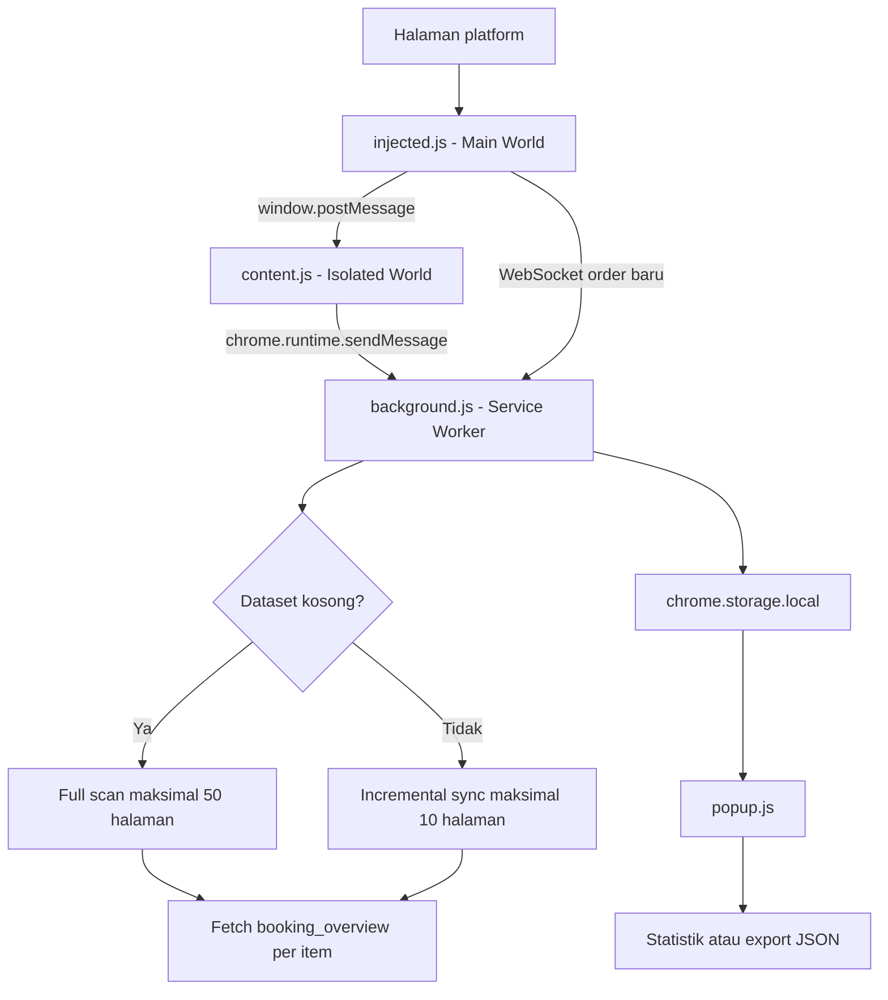

# Auto Order Scanner & Incremental Sync

Ekstensi browser Chromium Manifest V3 untuk menangkap data order atau bidding dari aplikasi web yang sedang dibuka, mengambil detail booking, dan mengekspor hasilnya sebagai JSON.

Ekstensi ini ditujukan untuk aplikasi web yang menggunakan endpoint daftar berikut:

```text
/api/line_haul/agency/booking/bidding/list
```

**Versi:** `1.4.0`
**Jenis:** ekstensi unpacked tanpa build tool atau dependency eksternal.

## Mulai Cepat

1. Pastikan browser berbasis Chromium dan sesi login platform target tersedia.
2. Buka `chrome://extensions` atau `edge://extensions`.
3. Aktifkan **Developer mode**, pilih **Load unpacked**, lalu pilih folder repository ini.
4. Buka halaman daftar booking atau bidding pada platform target.
5. Reload halaman agar request daftar dapat ditangkap.
6. Buka popup ekstensi dan gunakan **Reset & Full Scan** untuk pengambilan pertama.

Setelah konfigurasi API tertangkap, ekstensi menyimpan dataset secara lokal. Gunakan **Cek Order Baru** untuk sinkronisasi manual dan **Unduh Hasil JSON** untuk mengekspor hasil.

## Fitur

- Menangkap konfigurasi request endpoint daftar melalui `fetch` dan `XMLHttpRequest`.
- Mendeteksi order realtime dari pesan WebSocket yang memiliki `id`, `booking_id`, atau `order_id`.
- Mendukung navigasi SPA dengan memantau `history.pushState`, `history.replaceState`, dan `popstate`.
- Menjalankan full scan hingga 50 halaman dengan ukuran 20 item per halaman.
- Menambahkan detail setiap item melalui endpoint:

  ```text
  /api/line_haul/agency/booking/bidding/booking_overview?id={id}
  ```

- Menjalankan pengecekan order baru secara periodik setiap 1 menit menggunakan `chrome.alarms`.
- Menghentikan incremental sync ketika menemukan ID yang sudah tersimpan.
- Mencegah full scan dan incremental sync berjalan bersamaan dengan lock di `chrome.storage.local`.
- Menampilkan jumlah data dan order baru pada popup serta badge ekstensi.
- Mengunduh dataset tersimpan sebagai file JSON.

## Persyaratan

- Google Chrome, Microsoft Edge, atau browser Chromium lain yang mendukung Manifest V3.
- Sesi login aktif pada platform target.
- Halaman platform target harus terbuka agar request awal dapat ditangkap dan sesi autentikasi tetap tersedia.

## Struktur File

| File | Tanggung jawab |
| --- | --- |
| `manifest.json` | Konfigurasi Manifest V3, permission, service worker, popup, dan content script. |
| `injected.js` | Berjalan di Main World untuk mengintersep `fetch`, XHR, WebSocket, dan navigasi SPA. |
| `content.js` | Jembatan antara `window.postMessage` dan background service worker. |
| `background.js` | Menjalankan full scan, incremental sync, enrichment, lock, alarm, storage, badge, dan notifikasi. |
| `popup.html` | Tampilan popup monitor order. |
| `popup.js` | Membaca storage, memperbarui statistik, menjalankan aksi popup, dan mengekspor JSON. |
| `README.md` | Dokumentasi proyek. |

## Instalasi dari Source

Clone repository:

   ```bash
   git clone https://github.com/soalehj/booking-scraper-ext.git
   cd booking-scraper-ext
   ```

Kemudian buka halaman ekstensi browser:
   - Chrome: `chrome://extensions`
   - Edge: `edge://extensions`
1. Aktifkan **Developer mode**.
2. Pilih **Load unpacked** atau **Muat tanpa kemasan**.
3. Pilih folder yang berisi `manifest.json`.

Setelah ada perubahan pada file ekstensi, buka halaman ekstensi dan tekan **Reload** pada ekstensi tersebut.

## Penggunaan

1. Buka platform target, login, lalu buka halaman daftar booking/bidding.
2. Reload halaman dan tunggu request daftar selesai.
3. Buka popup ekstensi:
   - **Cek Order Baru** menjalankan incremental sync secara manual.
   - **Reset & Full Scan** menghapus dataset saat ini lalu memindai ulang maksimal 50 halaman.
   - **Unduh Hasil JSON** mengunduh seluruh dataset yang tersimpan.
4. Biarkan tab platform terbuka untuk menerima event WebSocket realtime. Alarm sinkronisasi berjalan setiap 1 menit setelah ekstensi di-install.

Pada pemakaian pertama, request daftar yang tertangkap memicu full scan otomatis jika dataset kosong. Jika dataset sudah ada, request tersebut memicu pengecekan order baru.

## Alur Data



### Full scan

Full scan mengambil halaman mulai dari halaman 1. Untuk request `POST`, parameter paginasi ditambahkan ke body. Untuk request selain `POST`, parameter tersebut ditambahkan ke query string. Beberapa nama parameter yang dikirim untuk kompatibilitas backend adalah `page`, `page_no`, `pageNo`, `page_number`, `current`, `pageSize`, `page_size`, `size`, dan `offset`.

Scan berhenti ketika response kosong, tidak berhasil, tidak menemukan item baru, atau mencapai 50 halaman. Item dideduplikasi berdasarkan salah satu field berikut:

```text
id, booking_id, id_booking, booking_no, code
```

### Incremental sync

Incremental sync dimulai dari halaman pertama dan memeriksa maksimal 10 halaman. Item baru dikumpulkan sampai ditemukan ID yang sudah ada di dataset. Item baru ditempatkan di awal dataset, lalu diperkaya dengan detail overview.

Alarm background dibuat dengan interval 1 menit saat ekstensi di-install. Selain itu, pengecekan dapat dijalankan manual dari popup.

### Enrichment

Setiap item yang memiliki ID akan diminta detailnya melalui endpoint overview. Request dijalankan dalam batch berisi maksimal 5 item dengan jeda 150 ms antar batch. Jika detail gagal, item tetap disimpan dengan `overview: null` dan informasi error bila tersedia.

## Data yang Disimpan

Ekstensi menggunakan `chrome.storage.local` dengan key berikut:

| Key | Isi |
| --- | --- |
| `apiConfig` | URL, method, header, body, dan timestamp request daftar yang terakhir tertangkap. |
| `scannedDataset` | Array order yang sudah dikumpulkan dan, bila memungkinkan, diperkaya dengan `overview`. |
| `lastNewOrderCount` | Jumlah item baru pada sync terakhir yang menemukan order baru. |
| `lastSyncTimestamp` | Waktu sync terakhir dalam format timestamp millisecond. |
| `isSyncLocked` | Lock untuk mencegah dua pipeline berjalan bersamaan. |

Header request disaring sebelum dipakai ulang. Header browser tertentu seperti `host`, `origin`, `referer`, `user-agent`, dan header `sec-fetch-*` tidak diteruskan.

## Permission

`manifest.json` meminta permission berikut:

- `storage`: menyimpan konfigurasi dan dataset lokal.
- `activeTab` dan `scripting`: dukungan interaksi dengan tab aktif.
- `alarms`: menjalankan incremental sync periodik.
- `notifications`: memberi notifikasi ketika order baru ditemukan.
- `<all_urls>`: menjalankan script dan melakukan request pada halaman atau origin yang diperlukan oleh aplikasi target.

> Karena ekstensi membaca request aplikasi dan menyimpan header/body konfigurasi API secara lokal, gunakan hanya pada profil browser dan platform yang memang Anda berwenang akses.

## Penyesuaian untuk Platform Lain

### Mengganti endpoint daftar

Ubah konstanta berikut di `injected.js`:

```js
const TARGET_ENDPOINT = '/api/line_haul/agency/booking/bidding/list';
```

Nilai ini menentukan request mana yang akan ditangkap sebagai konfigurasi API.

### Menyesuaikan field ID

Jika platform memakai nama field ID lain, tambahkan field tersebut pada `getItemId` di `background.js`:

```js
function getItemId(item) {
  if (!item || typeof item !== 'object') return '';
  return String(item.id || item.booking_id || item.id_booking || item.booking_no || item.code || '');
}
```

### Menyesuaikan bentuk response

Fungsi `extractItemsFromResponse` sudah mendukung response berbentuk array dan beberapa lokasi umum seperti `data`, `data.list`, `data.items`, `data.rows`, `data.records`, `data.booking_list`, `items`, `rows`, dan `result`. Tambahkan mapping di fungsi tersebut bila response platform berbeda.

## Troubleshooting

### Badge menampilkan `ERR`

Pastikan sesi login masih aktif, halaman platform dapat memuat daftar order, dan request pertama sudah terjadi setelah halaman di-reload. Periksa error pada service worker melalui halaman ekstensi browser.

### Full scan tidak menemukan data

Periksa hal berikut:

- URL request benar-benar mengandung endpoint `TARGET_ENDPOINT`.
- Response endpoint berisi array item pada salah satu bentuk yang didukung.
- Method dan body pagination dapat diterima oleh backend.
- Tidak ada lock lama pada `isSyncLocked` setelah proses sebelumnya terhenti.

### Data berhenti sebelum semua order terbaca

Full scan memiliki batas 50 halaman dan ukuran halaman 20 item. Backend juga dapat menghentikan scan jika parameter pagination yang dikirim tidak sesuai. Sesuaikan `buildRequestPayload` dengan kontrak API target.

### Order baru tidak muncul otomatis

Pastikan dataset awal sudah pernah dibuat, halaman platform masih terbuka, dan konfigurasi `apiConfig` masih tersimpan. Incremental sync hanya berjalan pada maksimal 10 halaman dan berhenti ketika menemukan ID yang sudah ada.

### Overview tidak lengkap

Item tanpa ID tidak dapat diminta detailnya. Untuk error HTTP atau error jaringan, item tetap disimpan dan field `overview_error` dapat berisi penyebab kegagalan.

## Batasan Teknis

- Ekstensi bergantung pada struktur endpoint dan response platform target.
- Full scan dibatasi maksimal 50 halaman; incremental sync dibatasi maksimal 10 halaman.
- Data disimpan lokal pada profil browser dan tidak dikirim ke server eksternal oleh ekstensi secara langsung.
- Sinkronisasi background membutuhkan konfigurasi API yang sudah tertangkap sebelumnya.
- Event WebSocket hanya diproses jika payload memiliki field ID yang dikenali.
- Tidak ada test runner atau proses build otomatis di repository ini.